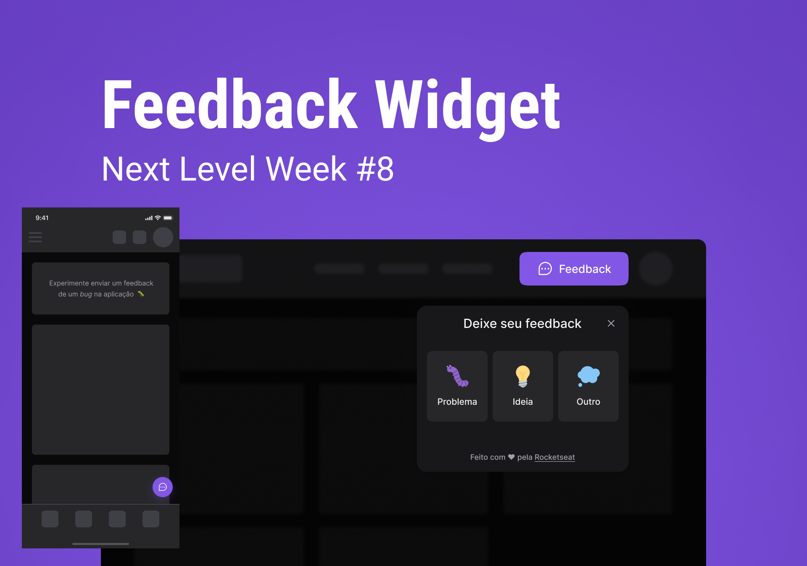

<h1 align="center">
   
</h1>

<p align="center">
  
  
  
  
  <a href="https://github.com/ivopereira-jr/Next-Level-Week-Return/commits/master">
    
  </a>
  
  
</p>

<br/>

<p align="center">
  <a href="#-sobre-o-projeto">
Sobre o projeto</a>&nbsp;&nbsp;&nbsp;|&nbsp;&nbsp;&nbsp;
  <a href="#-Tecnologias">Tecnologias</a>&nbsp;&nbsp;&nbsp;|&nbsp;&nbsp;&nbsp;
  <a href="#-someçando">Começando</a>&nbsp;&nbsp;&nbsp;|&nbsp;&nbsp;&nbsp;
  <a href="#-como-contribuir">Como contribuir</a>&nbsp;&nbsp;&nbsp;|&nbsp;&nbsp;&nbsp;
  <a href="#-license">License</a>
</p>



<br/>

## 👨🏻‍💻 Sobre o projeto

A Next Level Week Heat esta na 8º edição desse evento oferecido pela [Rocketseat](https://rocketseat.com.br) para a comunidade. Nessa edição, na trilha Impulse, foi desenvolvida um widget completo e acessível que pode ser utilizado em múltiplos projetos para coletar feedbacks dos usuários.

<br/>

## 🔖 Layout

Você pode visualizar o layout do projeto através do link abaixo:

- [Feedback Widget - Figma](https://www.figma.com/community/file/1102912516166573468)

Lembrando que você precisa ter uma conta para acessá-lo [Figma](http://figma.com/).

<br/>

## 🚀 Tecnologias

Tecnologias utilizadas

- [Node.js](https://nodejs.org/en/)
- [ReactJS](https://reactjs.org/)
- [Tailwind CSS](https://tailwindcss.com/)
- [TypeScript](https://www.typescriptlang.org/)
- [React Native](https://reactnative.dev/)
- [Expo](https://expo.io/)
- [Vitejs](https://vitejs.dev/)
- [Express](https://expressjs.com/)
- [Prisma](https://www.prisma.io/)

<br/>

## 💻 Começando

<br/>

### Requisitos

- [Node.js](https://nodejs.org/en/)
- [Yarn](https://classic.yarnpkg.com/) ou [npm](https://www.npmjs.com/)

<br/>

**Clone o projeto**

```bash
$ git clone hhttps://github.com/ivopereira-jr/Next-Level-Week-Return
```

**Siga os passos abaixo**

### Backend

```bash
# Starting from the project root folder, go to backend folder
$ cd server

# Install the dependencies
$ yarn or npm i

# To finish, run the api service
$ yarn run dev

# Well done, project is started!
http://localhost:3333

```

### Web

_Obs.: Antes de continuar, certifique-se de ter a API em execução_

```bash
# Starting from the project root folder, go to frontend folder
$ cd web

# Install the dependencies
$ yarn ou npm i

# Be sure the file 'src/services/api.ts' have the IP to your API

# Start the client
$ yarn start
```

### Mobile

_Obs.: Antes de continuar, certifique-se de ter a API em execução_

```bash
# Starting from the project root folder, go to mobile folder
$ cd mobile

# Install the dependencies
$ yarn ou npm i

# Be sure the file 'src/services/api.ts' have the IP to your API

# Start the app
$ yarn start

# If you are going to emulate with android, run this command
# Be sure to have the emulator open
$ yarn android

# If you are going to emulate with ios, run this command
$ yarn ios

```

<br/>

## 🤔 Como contribuir

**Faça um fork deste repositório**

```bash
# Fork usando a linha de comando oficial do GitHub
# Se você não tiver a CLI do GitHub, use o site para fazer isso.

$ gh repo fork ivopereira-jr/Next-Level-Week-Return
```

**Siga os passos abaixo**

```bash
# Clone your fork
$ git clone your-fork-url && cd NOME_DO_REPO

# Create a branch with your feature
$ git checkout -b my-feature

# Make the commit with your changes
$ git commit -m 'feat: My new feature'

# Send the code to your remote branch
$ git push origin my-feature

```

Depois que sua solicitação pull for mesclada, você poderá excluir sua ramificação

<br/>

## 📝 Licença

Este projeto está licenciado sob a Licença MIT - consulte o arquivo [LICENSE](./LICENSE.md) para obter detalhes.

---

<br/>

Feito com 💜 por Ivo Pereira ✌🏽 [Entre em contato ](https://www.linkedin.com/in/ivopereira-jr/)
